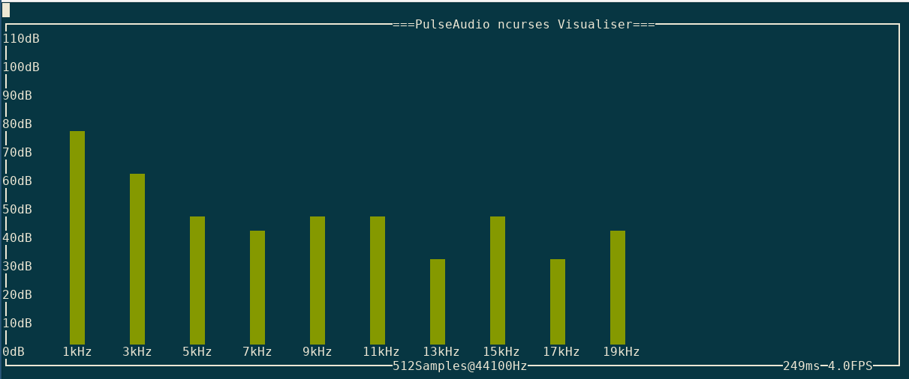

# Purses - A PulseAudio ncurses Audio Visualiser written in C 
Purses is an audio visualiser that interfaces with the PulseAudio sound server to provide a real-time audio visualisation of an output sink on the command line.
 
Inspired by pulsemixer (https://github.com/GeorgeFilipkin/pulsemixer).

## How to build

There are 2 targets in the Makfile, 'compile' and 'test':
1. `Make compile` will compile sources and generate a platform specific binary `purses.out`
2. `Make compile` will compile test sources and generate a platform specific binary `tests.out` that performs unit testing

## System Dependencies 
1. ncurses (system header is used)
2. pulseaudio (system header) (https://www.freedesktop.org/software/pulseaudio/doxygen/index.html)

## Usage

* You can hold 'q' to quit

### Testing mode
 If you set the environment variable PURSES_TEST_MODE to 1 (true) then a delay of 60s will we added between each frame of the main reading, processing, and rendering loop. Hitting any key will then continue onwards.
